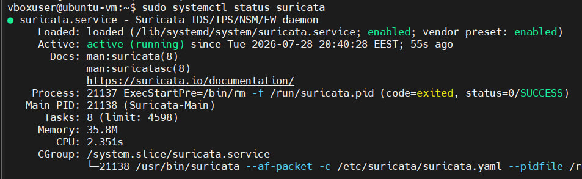
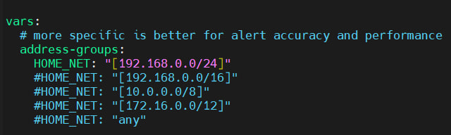
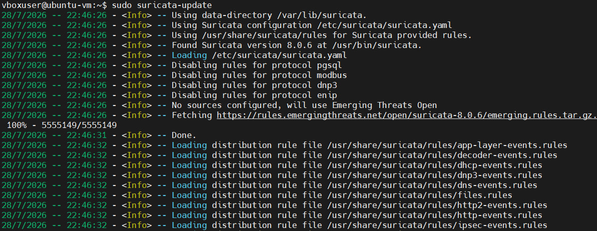
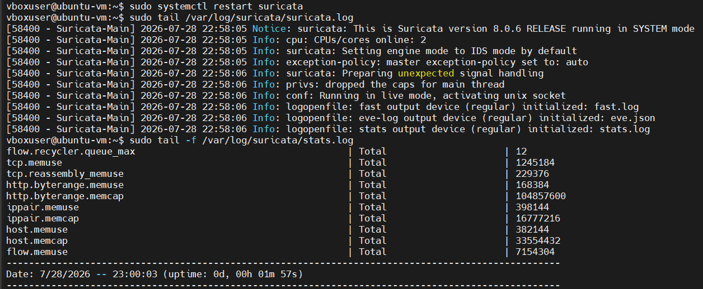
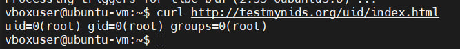
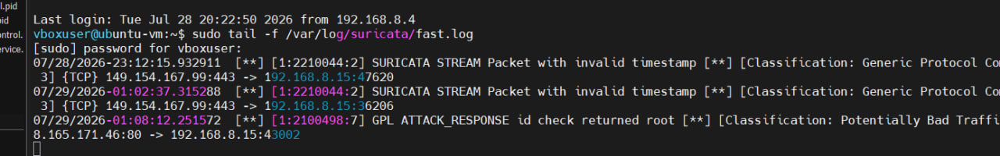

### Крок 1: Запуск VM, вхід у систему, перевірка IP-адреси, підключення через SSH (MobaXterm)

Запущено віртуальну машину Ubuntu у VirtualBox та виконано вхід у систему. Визначаємо IP-адресу мережевого інтерфейса віртуальної машини:
```sh
ip a
```


Отриману IP-адресу використано для налаштування SSH-сесії в MobaXterm (вказано хост, ім'я користувача та порт 22) для подальшого віддаленого підключення до VM.


### Крок 2: Встановлення Suricata

Виконано встановлення необхідного програмного забезпечення та самої системи Suricata:
1.Встановлено пакет software-properties-common, потрібний для роботи з репозиторіями;
```sh
sudo apt-get install software-properties-common
```
2.Додано офіційний репозиторій OISF (ppa:oisf/suricata-stable), який містить стабільну версію Suricata;
```sh
sudo add-apt-repository ppa:oisf/suricata-stable
```
3.Оновлено список пакетів командою apt update;
```sh
sudo apt update
```
4.Встановлено Suricata та утиліту jq (для зручної обробки JSON-логів);
```sh
sudo apt install suricata jq
```
5.Перевірено версію та параметри збірки Suricata командою suricata --build-info;
```sh
sudo suricata --build-info
```
6.Перевірено статус служби командою systemctl status suricata.
```sh
sudo systemctl status suricata
```


### Крок 3: Налаштування конфігурації

Відредаговано конфігураційний файл /etc/suricata/suricata.yaml командою:
```sh
sudo nano /etc/suricata/suricata.yaml
```
Основні зміни:
- у секції HOME_NET вказано мережу, до якої належить моніторингований інтерфейс (192.168.8.0/24 — відповідно до реальної IP-адреси віртуальної машини);

- у секції af-packet вказано назву мережевого інтерфейсу (enp0s3), який реально використовується у системі, замість стандартного прикладу eth0;
- додано рекомендовані параметри продуктивності: cluster-id: 99, cluster-type: cluster_flow, defrag: yes, use-mmap: yes, tpacket-v3: yes.

### Крок 4: Встановлення сигнатур (правил) Suricata
Виконано команду 
```sh
sudo suricata-update
```
Команда автоматично завантажує актуальний набір правил детектування (сигнатур) з відкритого джерела Emerging Threats. Утиліта завантажує архів з правилами, розпаковує його та встановлює у стандартну директорію правил (/var/lib/suricata/rules), одночасно вимикаючи правила для протоколів, які не використовуються в поточній конфігурації (наприклад, pgsql, modbus, dnp3, enip).


### Крок 5: Запуск Suricata
Після налаштування правил Suricata необхідно перезапустити сервіс, щоб зміни набули чинності, та перевірити коректність його роботи.
Перезапуск служби Suricata для застосування оновленої конфігурації та правил:
```sh
sudo systemctl restart suricata
```
Перегляд останніх записів основного лог-файлу для перевірки успішного запуску:
```sh
sudo tail /var/log/suricata/suricata.log
```
Перегляд статистики роботи Suricata у реальному часі:
```sh
sudo tail -f /var/log/suricata/stats.log
```


Cлужба Suricata успішно перезапущена та функціонує стабільно — двигун запущено без помилок, потоки обробки пакетів активні, а статистика підтверджує коректну обробку мережевого трафіку/

### Крок 6: Спрацювання сигнатур Suricata
На цьому етапі перевіряється здатність Suricata виявляти підозрілу мережеву активність за допомогою вбудованих сигнатур (правил), використовуючи тестовий домен testmynids.org, спеціально призначений для перевірки роботи IDS/IPS-систем.
Надсилання HTTP-запиту на спеціальний тестовий ресурс. У відповідь сервер повертає рядок uid=0(root) gid=0(root) groups=0(root), що імітує вивід команди id — це навмисно "підозрілий" контент, призначений для спрацювання сигнатур, які реагують на витік інформації про облікові дані:
```sh
curl http://testmynids.org/uid/index.html
```


Перегляд у реальному часі журналу сповіщень (alerts), куди Suricata записує всі спрацьовані правила:
```sh
sudo tail -f /var/log/suricata/fast.log
```


