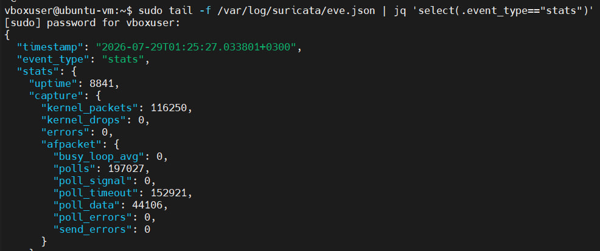
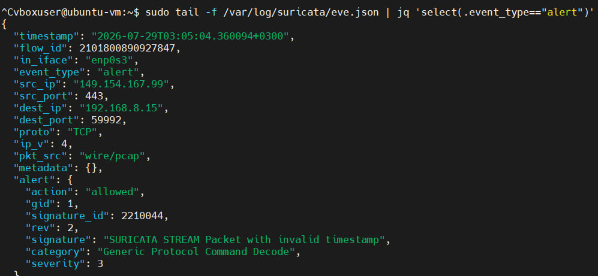
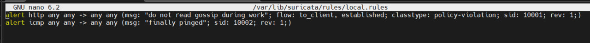
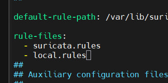
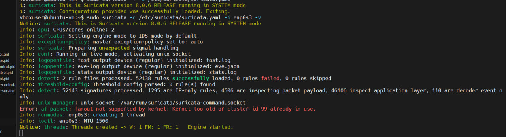
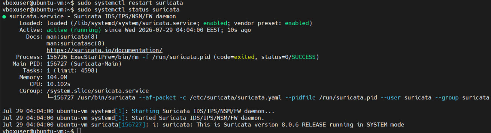
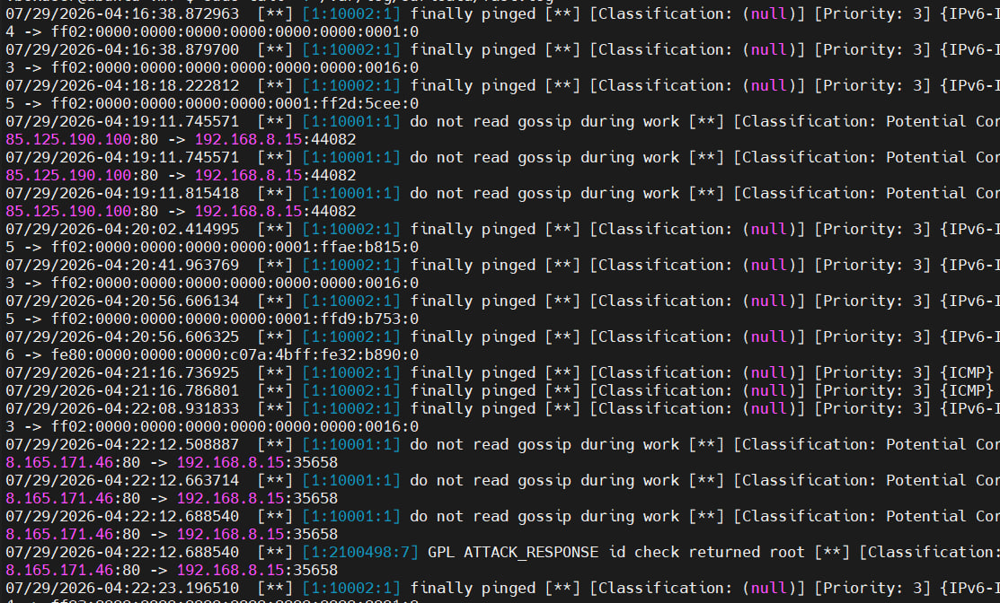

### Крок 1: Запуск VM, вхід у систему, перевірка IP-адреси, підключення через SSH (MobaXterm)

Запущено віртуальну машину Ubuntu у VirtualBox та виконано вхід у систему. Визначаємо IP-адресу мережевого інтерфейса віртуальної машини:
```sh
ip a
```


Отриману IP-адресу використано для налаштування SSH-сесії в MobaXterm (вказано хост, ім'я користувача та порт 22) для подальшого віддаленого підключення до VM.


### Крок 2: Встановлення Suricata

Виконано встановлення необхідного програмного забезпечення та самої системи Suricata:
1.Встановлено пакет software-properties-common, потрібний для роботи з репозиторіями;
```sh
sudo apt-get install software-properties-common
```
2.Додано офіційний репозиторій OISF (ppa:oisf/suricata-stable), який містить стабільну версію Suricata;
```sh
sudo add-apt-repository ppa:oisf/suricata-stable
```
3.Оновлено список пакетів командою apt update;
```sh
sudo apt update
```
4.Встановлено Suricata та утиліту jq (для зручної обробки JSON-логів);
```sh
sudo apt install suricata jq
```
5.Перевірено версію та параметри збірки Suricata командою suricata --build-info;
```sh
sudo suricata --build-info
```
6.Перевірено статус служби командою systemctl status suricata.
```sh
sudo systemctl status suricata
```


### Крок 3: Налаштування конфігурації

Відредаговано конфігураційний файл /etc/suricata/suricata.yaml командою:
```sh
sudo nano /etc/suricata/suricata.yaml
```
Основні зміни:
- у секції HOME_NET вказано мережу, до якої належить моніторингований інтерфейс (192.168.8.0/24 — відповідно до реальної IP-адреси віртуальної машини);

- у секції af-packet вказано назву мережевого інтерфейсу (enp0s3), який реально використовується у системі, замість стандартного прикладу eth0;
- додано рекомендовані параметри продуктивності: cluster-id: 99, cluster-type: cluster_flow, defrag: yes, use-mmap: yes, tpacket-v3: yes.

### Крок 4: Встановлення сигнатур (правил) Suricata
Виконано команду 
```sh
sudo suricata-update
```
Команда автоматично завантажує актуальний набір правил детектування (сигнатур) з відкритого джерела Emerging Threats. Утиліта завантажує архів з правилами, розпаковує його та встановлює у стандартну директорію правил (/var/lib/suricata/rules), одночасно вимикаючи правила для протоколів, які не використовуються в поточній конфігурації (наприклад, pgsql, modbus, dnp3, enip).


### Крок 5: Запуск Suricata
Після налаштування правил Suricata необхідно перезапустити сервіс, щоб зміни набули чинності, та перевірити коректність його роботи.
Перезапуск служби Suricata для застосування оновленої конфігурації та правил:
```sh
sudo systemctl restart suricata
```
Перегляд останніх записів основного лог-файлу для перевірки успішного запуску:
```sh
sudo tail /var/log/suricata/suricata.log
```
Перегляд статистики роботи Suricata у реальному часі:
```sh
sudo tail -f /var/log/suricata/stats.log
```


Cлужба Suricata успішно перезапущена та функціонує стабільно — двигун запущено без помилок, потоки обробки пакетів активні, а статистика підтверджує коректну обробку мережевого трафіку/

### Крок 6: Спрацювання сигнатур Suricata
На цьому етапі перевіряється здатність Suricata виявляти підозрілу мережеву активність за допомогою вбудованих сигнатур (правил), використовуючи тестовий домен testmynids.org, спеціально призначений для перевірки роботи IDS/IPS-систем.
Надсилання HTTP-запиту на спеціальний тестовий ресурс. У відповідь сервер повертає рядок uid=0(root) gid=0(root) groups=0(root), що імітує вивід команди id — це навмисно "підозрілий" контент, призначений для спрацювання сигнатур, які реагують на витік інформації про облікові дані:
```sh
curl http://testmynids.org/uid/index.html
```


Перегляд у реальному часі журналу сповіщень (alerts), куди Suricata записує всі спрацьовані правила:
```sh
sudo tail -f /var/log/suricata/fast.log
```


### Крок 7: Формат логів EVE JSON
Найбільш детальним і зручним для подальшої обробки способом виводу подій Suricata є формат EVE JSON (Extensible Event Format). На відміну від fast.log, який дає короткий однорядковий вивід, eve.json — це потоковий журнал, куди в структурованому JSON-форматі записуються всі типи подій: сповіщення (alerts), аномалії, метадані, інформація про файли та специфічні для протоколів записи (HTTP, DNS, TLS тощо). Усі ці події пишуться в один спільний файл, що спрощує подальший аналіз та інтеграцію з SIEM-системами.
```sh
sudo tail -f /var/log/suricata/eve.json | jq 'select(event_type=="stats")'
```


Формат EVE JSON надає значно більш деталізовану та структуровану інформацію порівняно з fast.log, що робить його оптимальним для автоматизованого моніторингу, побудови дашбордів та інтеграції з зовнішніми системами аналізу безпеки. Використання jq дозволяє ефективно фільтрувати потрібний тип подій (наприклад, лише статистику чи лише алерти) із загального потоку логів.

Фільтрує загальний потік подій eve.json, залишаючи лише записи, у яких поле event_type дорівнює "alert". Це дозволяє відсіяти всі інші типи подій (stats, http, flow тощо) і зосередитись виключно на сповіщеннях про виявлені загрози:
```sh
sudo tail -f /var/log/suricata/eve.json | jq 'select(.event_type=="alert")'
```


Формат EVE JSON у поєднанні з jq надає значно повнішу картину події порівняно з коротким записом у fast.log — включаючи метадані потоку (flow_id), інтерфейс перехоплення, дії правила (action) та повний контекст сигнатури. Це робить eve.json основним джерелом даних для глибокого аналізу інцидентів та інтеграції з SIEM-системами.

### Крок 8: Формат правил Suricata
На цьому кроці розглядається структура правила Suricata — базовий синтаксис, за яким описуються сигнатури для виявлення мережевих загроз.

Правило складається з трьох основних частин:

Action (Дія) — визначає, що відбувається при спрацюванні правила (тобто коли трафік відповідає заданим умовам). Приклади дій: alert (згенерувати сповіщення), drop (відкинути пакет), pass (пропустити без перевірки), reject.
Header (Заголовок) — визначає протокол, IP-адреси, порти джерела та призначення, а також напрямок трафіку.
Rule options (Параметри правила) — визначають конкретний контекст і додаткові умови застосування правила (у круглих дужках).
Створення файлу з власними правилами:
```sh
/var/lib/suricata/rules# nano local.rules
```
Додані правила:
```sh
alert http any any -> any any (msg: "do not read gossip during work"; flow: to_client,established; classtype: policy-violation; sid: 10001; rev: 1;)
alert icmp any any -> any any (msg: "finally pinged"; sid: 10002; rev: 1;)
```

Підключення local.rules до конфігурації Suricata:
```sh
/var/lib/suricata/rules# nano /etc/suricata/suricata.yaml
```
У головному конфігураційному файлі suricata.yaml перевіряється/редагується секція завантаження правил:


Цей крок показує повний цикл додавання власної сигнатури — від написання правила у local.rules до його реєстрації в suricata.yaml через секцію rule-files. Після збереження змін необхідно перезапустити службу (sudo systemctl restart suricata), щоб нові правила набули чинності та почали аналізувати трафік.

### Крок 10: Ручний запуск Suricata з локальними правилами
На цьому кроці Suricata запускається вручну (не через systemctl, а напряму з командного рядка) з режимом підвищеної деталізації логування (-v), щоб перевірити коректність завантаження всіх правил, включно з щойно доданим local.rules.
```sh
/var/lib/suricata/rules# suricata -c /etc/suricata/suricata.yaml -i enp0s3 -v
```


А ось вигляд, коли запускаєш через systemctl:
```sh
sudo systemctl restart suricata
sudo systemctl status suricata
```


Ручний запуск — для тестування й дебагу, systemctl — для стабільної, керованої й безпечної роботи в реальних умовах.

### Крок 11: Спрацювання власних правил на практиці
На цьому кроці підтверджується, що обидва власноруч створені правила з local.rules (sid:10001 та sid:10002) реально спрацьовують і фіксуються в логах Suricata під час моніторингу живого трафіку.
```sh
tail -f /var/log/suricata/fast.log
```


Обидва власні правила з local.rules успішно інтегровані в движок Suricata і коректно спрацьовують на відповідний трафік у реальному часі — ICMP-правило реагує на всі ping-запити (IPv4/IPv6), а HTTP-правило фіксує вхідні HTTP-відповіді як потенційне порушення корпоративної політики. Це підтверджує, що весь ланцюжок — від написання правила, реєстрації в suricata.yaml, перезапуску служби до фактичного спрацювання на живому трафіку — працює коректно.

### Крок 12: Мої правила
1.Написання власних правил у local.rules:
```sh
alert http any any -> any any (msg: "custom rule: outbound HTTP GET detected"; flow: to_server,established; http.method; content:"GET"; classtype: policy-violation; sid: 20001; rev: 1;)
alert icmp any any -> any any (msg: "custom rule: ICMP echo request detected"; itype: 8; sid: 20002; rev: 1;)
```
Правило sid:20001 — фіксує вихідні HTTP GET-запити (flow: to_server, http.method; content:"GET"), тобто саме запити клієнта до сервера (на відміну від попереднього прикладу, де відстежувалась відповідь to_client). Класифікація — policy-violation.
Правило sid:20002 — фіксує ICMP echo request (itype: 8 — тип ICMP-повідомлення "echo request", тобто саме вихідний ping, а не відповідь на нього echo reply, яка мала б itype: 0). Це точніше налаштування порівняно з попереднім правилом sid:10002, яке ловило будь-який ICMP-трафік.

2. Перевірка коректності конфігурації перед запуском:
```bash
sudo suricata -T -c /etc/suricata/suricata.yaml
```
Прапорець -T запускає Suricata в тестовому режимі (test mode) — движок перевіряє синтаксис конфігураційного файлу та всіх правил, після чого одразу завершує роботу, не запускаючи захоплення трафіку.

3. Запуск/перезапуск служби через systemd:
```bash
sudo systemctl start suricata
sudo systemctl status suricata
```
Статус підтверджує успішний запуск: Active: active (running), процес Suricata-Main (PID 165680) працює під користувачем/групою suricata з параметрами --af-packet -c /etc/suricata/suricata.yaml.

4. Підтвердження завантаження правил:
```bash
sudo grep "rule files processed" /var/log/suricata/suricata.log | tail -1
```
Замість перегляду всього логу вручну, тут використано grep для швидкого пошуку саме потрібного рядка — ефективний спосіб перевірити результат завантаження правил одразу після старту служби. Підтверджено: 0 помилок, усі правила (включно з власними) успішно завантажені.

5. Тестове спрацювання правил на реальному трафіку:
```bash
ping -c 4 8.8.8.8
curl http://testmynids.org/uid/index.html
```
Цей крок демонструє повний і коректний робочий цикл: написання правил → перевірка синтаксису (-T) → безпечний запуск через systemctl → підтвердження завантаження (grep по логу) → практичне тестування (ping, curl) → підтвердження спрацювання саме тих сигнатур, які були написані вручну (SID 20001 та 20002), з коректною класифікацією та деталізацією за напрямком і типом трафіку.
