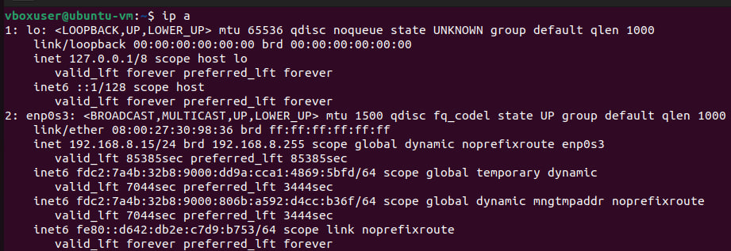
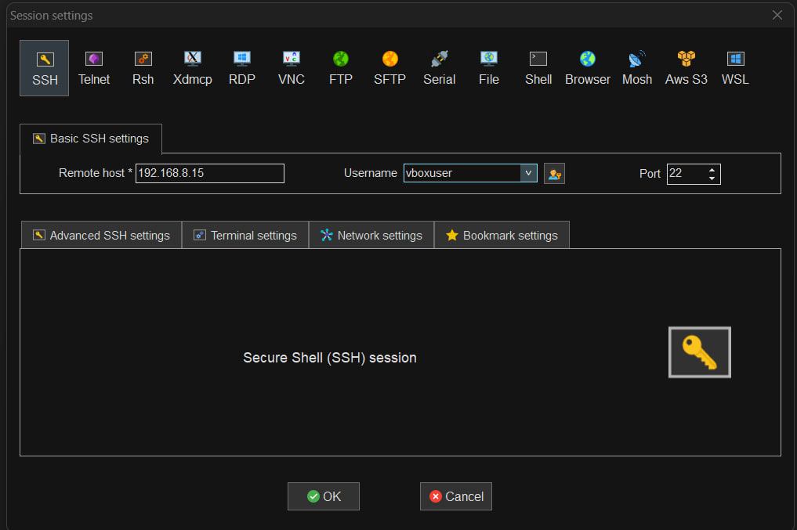

###Крок 1: Запуск VM, вхід у систему, перевірка IP-адреси, підключення через SSH (MobaXterm)
Запущено віртуальну машину Ubuntu у VirtualBox та виконано вхід у систему. Визначаємо IP-адресу мережевого інтерфейса віртуальної машини:
```sh
ip a
```


Отриману IP-адресу використано для налаштування SSH-сесії в MobaXterm (вказано хост, ім'я користувача та порт 22) для подальшого віддаленого підключення до VM.


###Встановлення Suricata
Виконано встановлення необхідного програмного забезпечення та самої системи Suricata:
1.Встановлено пакет software-properties-common, потрібний для роботи з репозиторіями;
```sh
sudo apt-get install software-properties-common
```
2.Додано офіційний репозиторій OISF (ppa:oisf/suricata-stable), який містить стабільну версію Suricata;
```sh
sudo add-apt-repository ppa:oisf/suricata-stable
```
3.Оновлено список пакетів командою apt update;
```sh
sudo apt update
```
4.Встановлено Suricata та утиліту jq (для зручної обробки JSON-логів);
```sh
sudo apt install suricata jq
```
5.Перевірено версію та параметри збірки Suricata командою suricata --build-info;
```sh
sudo suricata --build-info
```
6.Перевірено статус служби командою systemctl status suricata.
```sh
sudo systemctl status suricata
```
